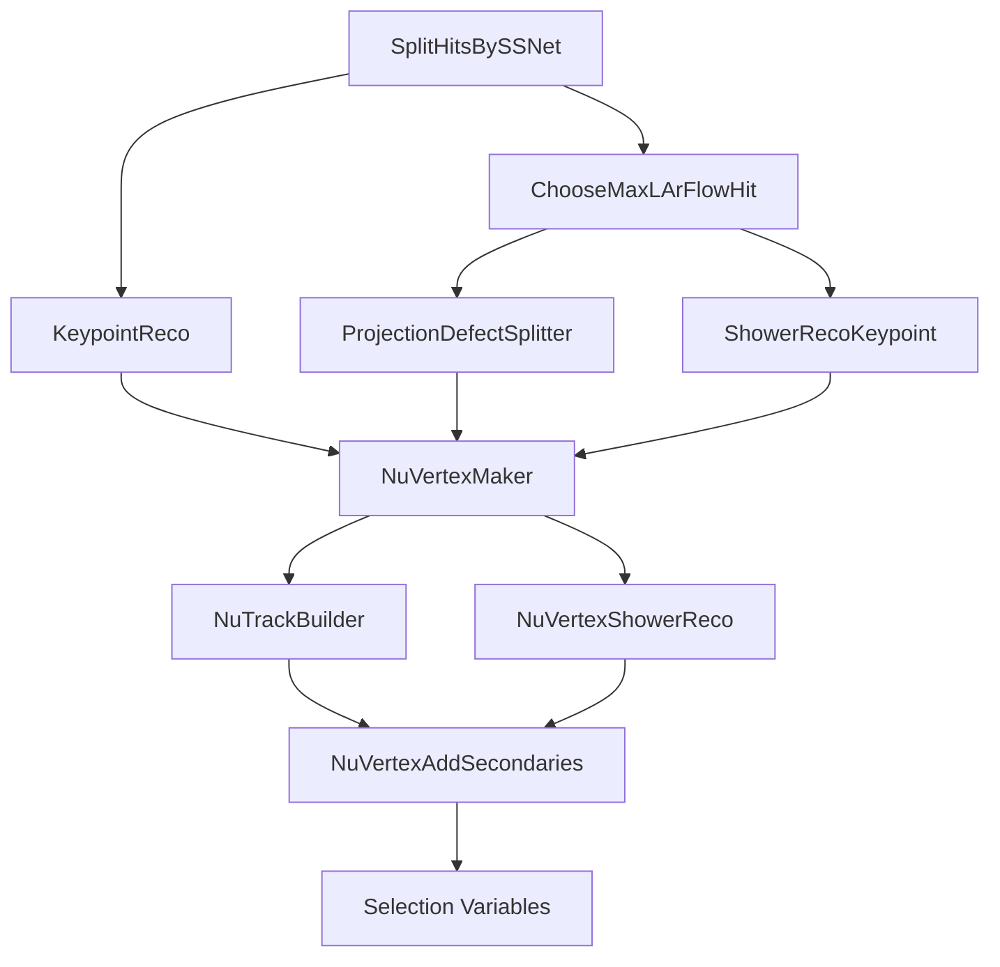

# LArFlow Reconstruction Algorithm Documentation

This document provides detailed documentation for the key algorithms used in the LArFlow reconstruction pipeline.

## Core Hit Processing Algorithms

### SplitHitsBySSNet

**Purpose**: Separates LArMatch 3D spacepoints into track and shower categories using SSNet scores.

**Location**: `larflow/Reco/SplitHitsBySSNet.h/cxx`

**Key Methods**:
- `label()`: Adds SSNet shower score to each hit without splitting
- `split()`: Separates hits into track/shower based on threshold
- `process_labelonly()`: Only labels hits with scores
- `process_splitonly()`: Only splits pre-labeled hits

**Parameters**:
- `_score_threshold` (default: 0.5): SSNet shower score threshold
- `_larmatch_threshold` (default: 0.1): Minimum LArMatch score to consider hit
- `_ssnet_stem_name`: Name of SSNet score images (default: "ubspurn_plane")

**Algorithm**:
1. For each 3D hit, project to 2D wire plane coordinates
2. Look up SSNet shower score at projected location
3. Store score in hit's `renormed_shower_score` field
4. If splitting, separate hits with score > threshold as shower

**Usage in Pipeline**:
- Called twice: once to label all hits, once to split filtered hits
- Critical for separating electromagnetic showers from tracks

### ChooseMaxLArFlowHit

**Purpose**: Reduces spacepoint density by selecting only the highest-scoring hit per pixel.

**Location**: `larflow/Reco/ChooseMaxLArFlowHit.h/cxx`

**Algorithm**:
1. Group hits by projected 2D pixel location on each plane
2. For hits projecting to same pixel, keep only highest LArMatch score
3. Return union of best hits across all planes

**Why Important**: 
- LArMatch can produce multiple 3D predictions per pixel
- Reduces computational load for downstream algorithms
- Improves reconstruction quality by using best predictions

## Keypoint Detection Algorithms

### KeypointReco

**Purpose**: Identifies physics keypoints (vertices, track ends, shower starts) from network scores.

**Location**: `larflow/Reco/KeypointReco.h/cxx`

**Key Methods**:
- `process()`: Main reconstruction function
- `_make_initial_pt_data()`: Filters hits above score threshold
- `_make_kpclusters()`: Clusters nearby high-score points
- `_characterize_cluster()`: Finds keypoint location within cluster

**Parameters**:
- `_keypoint_score_threshold_v`: Score thresholds per pass (default: 0.5)
- `_larmatch_score_threshold`: Minimum spacepoint quality (default: 0.1)
- `_sigma`: Gaussian width for score suppression (default: 10.0 cm)
- `_max_dbscan_dist`: Clustering distance (default: 0.7 cm)
- `_min_cluster_size_v`: Minimum hits per keypoint (default: 10)

**Algorithm**:
1. Select hits with keypoint score > threshold
2. DBSCAN clustering of high-score regions
3. For each cluster:
   - Find highest score point as initial keypoint
   - Fit Gaussian to refine position
   - Suppress nearby keypoints within sigma
4. Multi-pass approach for different score thresholds

**Output**: `KPCluster` objects containing:
- 3D position
- Keypoint type (nu vertex, track start/end, shower start)
- Score and associated hits

### KeypointFilterByWCTagger

**Purpose**: Separates in-time (neutrino) hits from cosmic hits using WireCell tagger.

**Location**: `larflow/Reco/KeypointFilterByWCTagger.h/cxx`

**Algorithm**:
1. Project each 3D hit to wire plane coordinates
2. Check WireCell "thrumu" image at projected location
3. If pixel value > threshold, mark as cosmic
4. Separate into "taggerfilterhit" (in-time) and "taggerrejecthit" (cosmic)

**Key Parameter**:
- Cosmic pixel threshold: typically 0.5

## Clustering Algorithms

### ProjectionDefectSplitter

**Purpose**: Splits track spacepoints into straight segments using projection defects.

**Location**: `larflow/Reco/ProjectionDefectSplitter.h/cxx`

**Algorithm**:
1. DBSCAN clustering of track hits
2. For each cluster:
   - Fit PCA axis
   - Project hits onto axis
   - Identify "defects" where projection deviates
   - Split at defect points
3. Fit line segment to each sub-cluster

**Parameters**:
- DBSCAN distance: 1.0 cm (in-time), 5.0 cm (cosmic)
- Minimum cluster size: 10 hits
- Defect threshold: Based on projection residual

**Output**: 
- `larflowcluster` objects representing straight track segments
- `pcaxis` objects with segment direction

### ShowerRecoKeypoint

**Purpose**: Builds shower clusters starting from shower keypoints.

**Location**: `larflow/Reco/ShowerRecoKeypoint.h/cxx`

**Algorithm**:
1. For each shower keypoint:
   - Define initial cone from keypoint
   - Collect shower hits within cone
   - Iteratively refine cone direction
   - Expand radius to capture full shower
2. Merge overlapping showers
3. Calculate shower trunk and energy

**Parameters**:
- Initial cone angle: 30 degrees
- Shower radius threshold: 5.0 cm
- Minimum hits: 20

## Vertex Building Algorithms

### NuVertexMaker

**Purpose**: Forms neutrino interaction candidates by associating keypoints with particle fragments.

**Location**: `larflow/Reco/NuVertexMaker.h/cxx`

**Key Methods**:
- `_createCandidates()`: Makes initial vertex from each keypoint
- `_attachClusterToCandidate()`: Associates clusters to vertices
- `_merge_candidates()`: Combines nearby vertices
- `_cosmic_veto_candidates()`: Removes cosmic-contaminated vertices

**Algorithm**:
1. Create candidate vertex at each neutrino keypoint
2. For each cluster (track/shower fragment):
   - Calculate impact parameter to vertex
   - Check gap between vertex and cluster start
   - Attach if passes distance cuts
3. Score vertices by number/quality of attachments
4. Merge vertices within 5 cm
5. Veto if too close to cosmic activity

**Scoring Factors**:
- Number of attached prongs
- Prong directions (prefer backward-going)
- Keypoint score
- Distance to detector boundaries

**Output**: `NuVertexCandidate` objects with:
- 3D position
- Associated cluster indices
- Vertex score

### NuTrackBuilder

**Purpose**: Assembles track fragments into complete particle tracks.

**Location**: `larflow/Reco/NuTrackBuilder.h/cxx`

**Algorithm**:
1. For each track cluster attached to vertex:
   - Start from vertex position
   - Connect fragments by proximity and direction
   - Use PCA axes to guide connections
   - Build ordered trajectory points
2. Smooth track with moving average
3. Handle branching for secondary particles

**Key Features**:
- Handles gaps between fragments
- Respects cluster ordering from vertex
- Can build multiple tracks per vertex

### NuVertexShowerReco

**Purpose**: Reconstructs electromagnetic showers from vertex candidates.

**Location**: `larflow/Reco/NuVertexShowerReco.h/cxx`

**Algorithm**:
1. Define search cone from vertex
2. For unattached shower clusters:
   - Check if trunk points to vertex
   - Calculate opening angle
   - Merge if consistent
3. Build shower profile:
   - Energy vs distance
   - Transverse width
   - dE/dx profile

**MC Analysis Mode**:
When enabled, saves detailed truth matching for shower development studies.

## Helper Algorithms

### NuVertexAddSecondaries

**Purpose**: Identifies and adds secondary particles (delta rays, recoils) to vertices.

**Algorithm**:
1. After primary prongs built, search for unused clusters
2. Check if cluster starts near primary track
3. Add as secondary if impact parameter < threshold

### NuVertexRestoreKPHits

**Purpose**: Recovers hits that were vetoed during clustering but belong to vertex region.

**Algorithm**:
1. Search hits rejected by keypoint veto
2. If within 5 cm of vertex, restore to appropriate prong
3. Helps recover vertex activity lost to conservative cuts

### CompressRecoTrack

**Purpose**: Reduces track points while preserving shape.

**Algorithm**:
1. Start with full trajectory
2. Remove points that don't change direction significantly
3. Keep points where track bends (sagitta > threshold)
4. Ensures maximum step size respected

**Parameters**:
- Max sagitta: 0.3 cm
- Max step size: 5.0 cm

## Selection Variable Algorithms

### NuSelUnrecoCharge

**Purpose**: Quantifies charge not associated with reconstructed particles.

**Algorithm**:
1. Project all reconstructed prongs to 2D
2. Create mask of explained pixels
3. Count ADC in unmasked regions
4. Separate by proximity to vertex

**Output Variables**:
- Unmatched charge near vertex (< 10 cm)
- Unmatched charge far from vertex
- Fraction of total charge explained

### LikelihoodProtonMuon

**Purpose**: Calculates particle ID likelihood for track classification.

**Algorithm**:
1. Extract features along track:
   - Local dE/dx
   - Scattering angles
   - Energy deposition pattern
2. Compare to templates for protons vs muons
3. Calculate log-likelihood ratio

### ShowerdQdx

**Purpose**: Measures electromagnetic shower dE/dx for particle ID.

**Algorithm**:
1. Sample shower hits in distance bins
2. Correct for shower geometry and density
3. Calculate truncated mean dQ/dx
4. Convert to dE/dx with calibration

## Algorithm Interdependencies

## Best Practices for Algorithm Development

### Adding New Algorithms

1. Inherit from `larcv::larcv_base` for logging
2. Implement `process()` method taking IOManager and storage_manager
3. Use `set_verbosity()` for debug control
4. Clear internal state in constructor or clear() method

### Parameter Tuning

1. Start with existing defaults
2. Use debug stop points to visualize results
3. Tune on MC before data
4. Document parameter choices

### Performance Optimization

1. Minimize hit copying
2. Use spatial indexing for searches
3. Implement early rejection cuts
4. Profile with large events

## Common Issues and Solutions

### Issue: Too many/few keypoints
- Adjust score thresholds
- Modify clustering parameters
- Check SSNet image quality

### Issue: Broken tracks
- Increase ProjectionDefectSplitter DBSCAN distance
- Reduce defect sensitivity
- Check hit filtering

### Issue: Missing shower energy
- Expand cone angle in ShowerRecoKeypoint
- Reduce shower trunk gap requirement
- Check shower/track classification

### Issue: Wrong vertex position
- Verify keypoint quality
- Check cluster attachment criteria
- Enable vertex position fitting