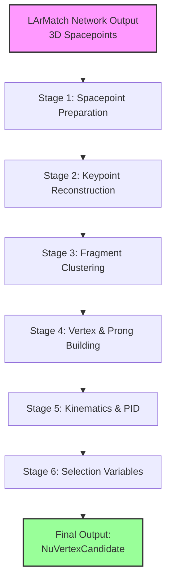
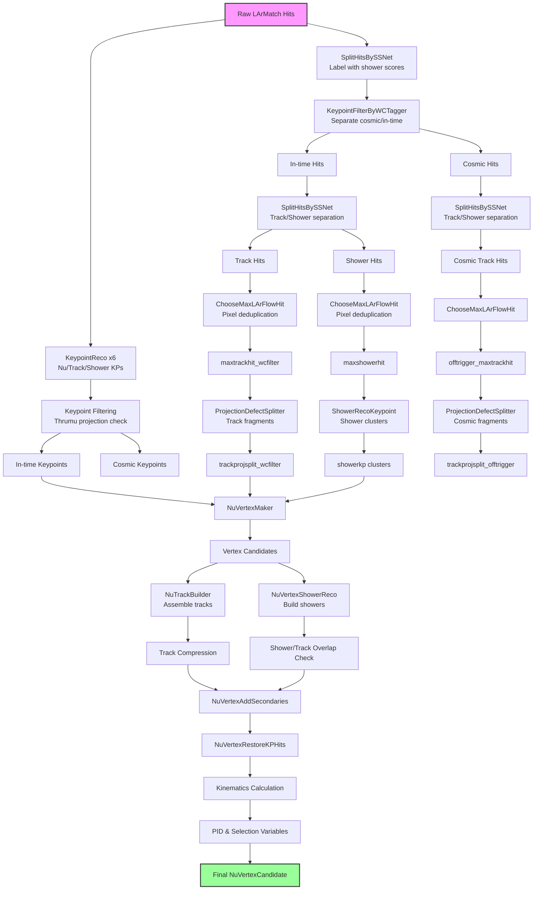

# LArFlow Reconstruction Flow Diagram

## High-Level Flow



## Detailed Algorithm Flow



## Data Products at Each Stage

### Input Data
- **larmatch**: Raw 3D spacepoints from neural network
- **ubspurn_plane[0,1,2]**: SSNet track/shower scores  
- **thrumu**: WireCell cosmic tagger images

### Stage 1 Output: Filtered Spacepoints
```
├── maxtrackhit_wcfilter     # In-time track hits (deduped)
├── maxshowerhit             # In-time shower hits (deduped)
├── offtrigger_maxtrackhit   # Cosmic track hits (deduped)
└── [intermediate products]
    ├── taggerfilterhit      # All in-time hits
    ├── taggerrejecthit      # All cosmic hits
    └── ssnetsplit_*         # Pre-deduplication splits
```

### Stage 2 Output: Keypoints
```
├── keypoint                 # In-time keypoint candidates
│   ├── Type 0: Nu vertex
│   ├── Type 1: Track start  
│   ├── Type 2: Track end
│   ├── Type 3: Shower start
│   ├── Type 4: Michel
│   └── Type 5: Delta
└── keypointcosmic           # Cosmic-tagged keypoints
```

### Stage 3 Output: Fragments
```
├── trackprojsplit_wcfilter  # In-time track segments
├── trackprojsplit_offtrigger # Cosmic track segments  
├── showerkp                 # Shower clusters with keypoints
└── shortproton              # Short proton candidates
```

### Stage 4 Output: Assembled Particles
```
NuVertexCandidate
├── pos[3]                   # 3D vertex position
├── track_v                  # Vector of larlite::track
├── shower_v                 # Vector of larlite::shower
├── track_len_v              # Track lengths
├── shower_plane_pixsum_vv   # Shower energies by plane
└── [cluster associations]   # Which clusters used
```

### Stage 5-6 Output: Physics Quantities
```
NuSelectionVariables
├── approx_vis_energy_MeV    # Total visible energy
├── max_proton_pid           # Best proton score
├── dist2truevtx             # MC truth matching
├── [prong variables]        # Per track/shower
└── [vertex variables]       # Vertex quality
```

## Algorithm Dependencies

### External Dependencies
- WireCell cosmic tagger (thrumu images)
- SSNet particle classification (ubspurn images)  
- LArMatch network scores (in spacepoint features)

### Internal Dependencies
1. Keypoints depend on filtered spacepoints
2. Fragment clustering uses keypoints for vetoing
3. Vertex building requires both keypoints and fragments
4. Track/shower builders need vertex seeds
5. Kinematics requires completed prongs
6. Selection variables need all reconstruction complete

## Configuration Parameters

### Key Thresholds
- Keypoint score threshold: 0.5
- LArMatch hit threshold: 0.5
- DBSCAN clustering distance: 0.7 cm (keypoints), 1.0 cm (tracks)
- Minimum cluster size: 10 hits
- Cosmic pixel sum threshold: 50.0

### Reconstruction Versions
- Version 1: Original algorithm set
- Version 2: Updated with improved shower reconstruction

## Performance Considerations

### Computational Bottlenecks
1. DBSCAN clustering in ProjectionDefectSplitter
2. Track fitting in NuTrackBuilder
3. Shower cone matching in NuVertexShowerReco

### Memory Usage
- Spacepoint containers can be large (>100k points)
- Multiple copies made during filtering stages
- Debug modes save additional intermediate products

## Debugging Tools

### Stop Points
Enable via KPSRecoManager methods:
- After spacepoint prep: See filtered hits
- After keypoint reco: Visualize keypoints
- After clustering: Check fragments
- After track building: Inspect tracks

### Visualization Products
When debug stops enabled:
- All intermediate hit containers saved
- Cluster + PCA axis pairs for 3D viz
- Keypoint locations and types
- Track trajectory points